Aiswariya Raja
3/5/2028

\#\#\#Project Outline: As a part of this project, I’m trying to address
the following question:

\#\#\#\#\#Is there a significant difference in income between men and
women? If yes, what are some factors contributing to this difference?

This project uses the NLSY79 (National Longitudinal Survey of Youth,
1979 cohort) data set. The NLSY79 data set contains survey responses of
individuals who were interviewed first in 1979. They were also
subsequently interviewed every one or two years after that up until
2012.

This project primarily consists of the following 4 sections:

1.  Data Summary

2.  Methodology

3.  Findings

4.  Discussion

                                                   *************************************

\`

\#\#1. Data Summary: As a part of the NLSY79 survey, **12686**
individuals were interviewed and responses were collected on a variety
of factors such as Country of Birth, Family Size, Marital Status, Income
etc. For the purpose of my analysis, I’ve subsetted the data to only
include individuals born in the United States. This brings my total
number of respondents to **11812**.

To analyse this problem of gender-based income difference, I chose the
following variables:

1.  **Income:** Total income of the respondent from waged and salary in
    the past calendar year as reported in 2012
2.  **Gender:** The sex of the respondent as reported in 1979
3.  **Race:** The respondent’s racial/ethnic cohort as reported in 1979
4.  **Marital Status:** The respondent’s marital status as reported in
    1979
5.  **Family Size:**The respondent’s family size as reported in 1979
6.  **Place of Birth:** The respondent’s place of birth in the US
    (South/Not South) as reported in 1979
7.  **Drug Use:** The number of times that the respondent has used
    Marijuana in his/her lifetime as reported in 1984
8.  **Foreign Language:** Foreign language that was spoken at home
    during respondent’s childhood as reported in 1979

*Note:* For most parts of this project, I have used income without
top-coded values. The rationale for this choice and how top-coded values
were dealt with will be explained as we progress further.

Since the problem is based on gender differences, let’s start by looking
at the number of male and female respondents in our subset.

\#\#\#\#\#Table 1: Number of respondents broken down by gender category

    ## 
    ## Female   Male 
    ##   5855   5956

From the above table we can see that, female respondents make up 49.57%
and male respondents make up 50.43% . We have an almost equal proportion
of male and female respondents.

To explore the problem of income disparity, let’s now take a look at the
average income of our respondents based on their gender category.

\#\#\#\#\#Table 2: Average Income of Men and Women

    ## gender
    ##   Female     Male 
    ## 39360.72 54152.71

As we can see from **Table 2**, the average income of men is
*income.sex.summary\[2\] - income.sex.summary\[1\] = $ 14,892* more than
women. To further understand the distribution of income between men and
women, let’s look at a box plot visualizing this difference.

\#\#\#\#\#Plot 1
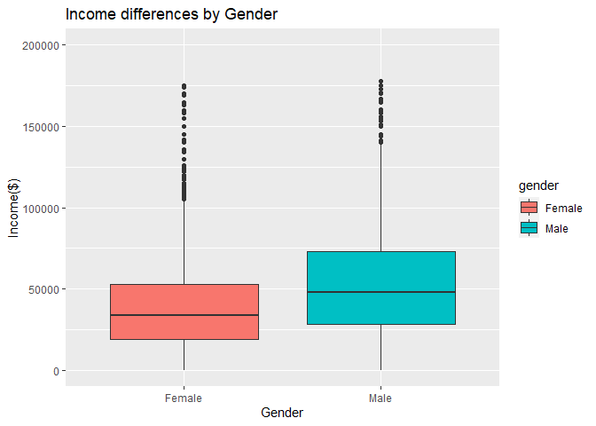<!-- -->

\#\#\#\#\#From the above plot, we have the following key takeaways. In
addition to lower average income of women compared to men:

1.  The median income of female respondents is definitely much less
    compared to that of male respondents.
2.  The lower quartile of women’s income is below that of men.
3.  The upper quartile of men’s income is above that of women.
4.  The interquartile range (IQR) of women’s income is lower than that
    of men.

At this point, we are certain that women are definitely earning less
than men. But, it is important to test if this difference is
statistically significant before we jump in to analyse factors
contributing to this disparity. For this purpose we will conduct a
t-test.

##### T-test for Income and Gender

    ## 
    ##  Welch Two Sample t-test
    ## 
    ## data:  income by gender
    ## t = -17.151, df = 3630.5, p-value < 2.2e-16
    ## alternative hypothesis: true difference in means is not equal to 0
    ## 95 percent confidence interval:
    ##  -30876.66 -24541.42
    ## sample estimates:
    ## mean in group Female   mean in group Male 
    ##             40851.39             68560.43

From the above t-test results, we can see that the difference in income
betweem men and women is statistically significant. With a p-value of 0,
we can safely conclude that the difference in income between the two
genders is not attributed to random chance or other sampling errors.

Now let’s dive right in to see what are some factors contributing to
this.

\#\#\#a) Race:

We have race data for all 11812 respondents in our subset. Let’s take a
look at the distribution of individuals across race categories.

\#\#\#\#\#Table 3: Number of respondents broken down by race categories

    ## 
    ##    Black Hispanic     NBNH 
    ##     3091     1479     7241

From above we can see that the largest number of respondents i.e *7241*
respondents are neither Black nor Hispanic. Let us now look at average
income of men and women across these race categories.

\#\#\#\#\#Table 4: Average Income of Men and Women across Race

    ##            Female     Male Difference
    ## Black    35020.28 42760.62   7740.339
    ## Hispanic 39383.50 51751.27  12367.765
    ## NBNH     41753.26 60870.71  19117.448

Within every single race category, we can see that average income of
women is lesser than that of men.The difference is largest among
**Non-Black Non-Hispanic** individuals and the least among **Black**
individuals. At a later point in this project we will investigate in
greater detail the income and income gap differences between men and
women within each race. Let’s look at a more visual representation of
the same.

To further understand the distribution of income between men and women
within each race category, let’s look at a visual representation of this
difference.

\#\#\#\#\#Plot 2
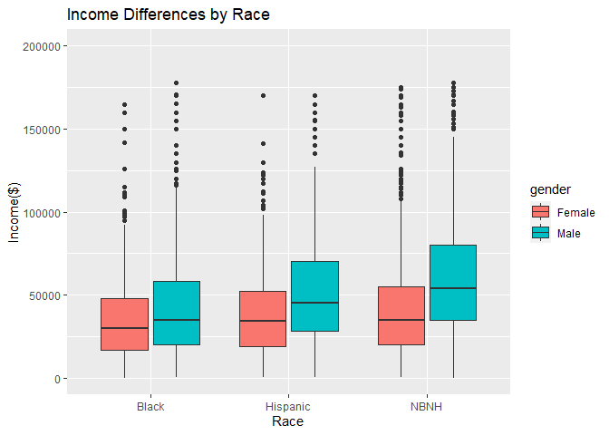<!-- -->

Similar to Plot 1, the above boxplot also indicates that not only is the
median income of women lower than that of men, but so is the lower and
upper quartile of women’s income compared to men. I observed a very
similar trend across **ALL** my variables of choice.

Let’s take a quick look at the boxplots visualizing how income varies
between men and women among a few other variables that I’ve chosen as
well - Industry, Foreign Language and Drug Use.

\#\#\#b) Industry:

\#\#\#\#\#Plot 3
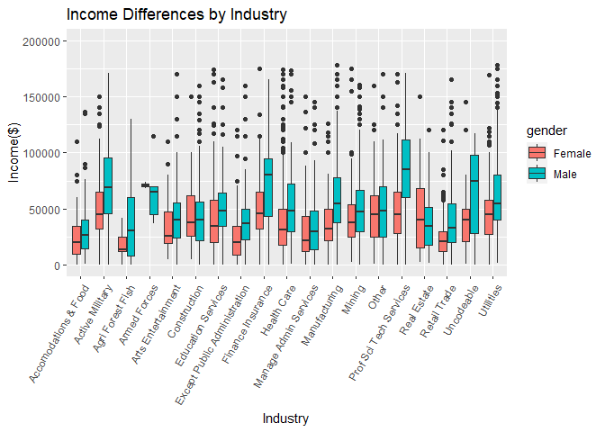<!-- -->

From this plot, we can see that the trend of lower income among women
prevails except in the case of women in the Armed Forces (albeit the
interquartile range is almost 0 for female income). Also, we see the
largest difference in income for Agriculture, Finance and Tech Services.
We do a more in-depth analysis of `industry` when we study the impact of
top-coded values.

\#\#\#c) Place of Birth:

\#\#\#\#\#Plot 4
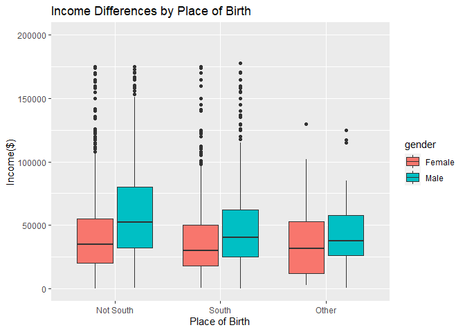<!-- -->

Again here, the trend of lower income among women continues across all
categories of Place of Birth. The largest disparity seems to be among
individuals who are from the North. We analyse the impact of `south` in
greater detail in the **Findings** section of this project.

Overall, it is evident from our data summary that there is a serious
case of income disparity between men and women and this prevails across
a variety of factors as discussed above. However, what we are really
interested in is **how serious** is this disparity. Is it statistically
significant? Are we **confident** of our conclusions? Do we have
sufficient conclusive proof to claim the impact of a specific variable
on the gender-based income difference? These are some questions that we
will explore through the remainder of this project.

                                                  *************************************
                                                  

\#\#\#2. Methodology:

Before I began exploring this dataset, I had to do **three** important
things:

1.  Deal with Missing Values
2.  Deal with Topcoded Values
3.  Create a subset to define a geographic boundary for my analysis

In this section, I will explain how I went about each of the above
items. Then we will look at how I got to my main findings in this
project.

\#\#\#\#**Missing Values:**

In this dataset, missing values came in the following categories:

1.  **Non-interview(Coded -5):** This includes respondents who did not
    participate at all in the survey that year. For 6 out of 8 variables
    that I chose, the number of non-participants was 0. So I didn’t
    encounter -5 at all for those 6 variables. However I did have about
    **617** non-participants for `drug.use` and **5385**
    non-participants for `income`. Even though \~43% did not participate
    at all to provide their income and that’s a huge percentage, there
    is very little that we can do about it. So, I just mapped -5s for
    both variables to NA.

2.  **Valid Skips (Coded -4):** This includes respondents who did not
    answer a question as it was not applicable to them. These
    respondents are therefore not a part of the Universe. Again here,
    for 6 out of 8 variables, I did not have to encounter this problem
    at all as the number of valid skips were 0. However, there were
    **7** valid skips for `income` and **9894** valid skips for
    `foreign.lang`. Valid Skips constitute 78% of the respondents in
    case of Foreign Language which is huge! So, assuming that this
    happened because none of the options of languages spoken were
    applicable to them, I mapped the Valid Skips to a new factor level
    called **None**. However, for `income` since this number was only 7,
    I simply mapped it to NA as it barely affects the sample size.

3.  **Invalid Skips, Don’t Know and Refusal (Coded -3,-2 and -1
    respectively):** These are respondents who missed a question that
    they should’ve answered due to an incorrect flow in the survey,
    didn’t know the answer or refused to respond to the question. The
    number of individuals in either of these categories were a very
    small number compared to the sample size. The highest number that I
    came across in this case was **146** respondents for the **Don’t
    Know** in case of `income`. With respondents in these categories
    contributing to **&lt;1%** of my sample size, I simply mapped them
    to NA.

\#\#\#\#**Topcoded Values:** Being a publicly available dataset,
top-coding helps protect the confidentiality of some responses. The
Income varaible has been top-coded to be the average income of the **top
2%** earners in this dataset for this very reason. However, to ensure
that this kind of averaging does not affect my analysis in anyway, I
took the following approach:

1.  **Create `income.clean`:**

If we summarize the `income` variable we will find that the largest
income value is USD 343,830 with 135 respondents in that bucket. Given
that USD 343,830 is the average of the top 2% earners in our dataset, I
created `income.clean` which maps 343830 to **NA**. For a cleaner
analysis, I mapped USD 0 (which had 1634) to **NA** as well. We have
1634 respondents who reported USD 0 as their income. By mapping this to
NA we further lose \~14% of our respodents. Unfortunately, this leaves
us with a sample size of only **4789** respondents as opposed to
**4924** individuals when we retain top-coded values. But this is still
a fairly large sample size and we will use the `income. clean` variable
for most of our analysis.

2.  **QQ Plot: Comparitive analysis of `income` and `income.clean` to
    check impact on analysis**

To further understand if removing top-coded values and 0 has an impact
on our analysis, let’s compare the QQ plots of `income` and
`income.clean`.

\#\#\#\#\#Plot 5: QQ plot of `income`
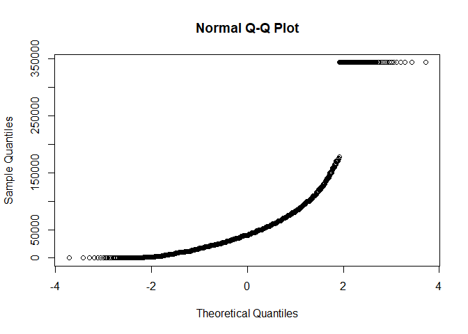<!-- -->

\#\#\#\#\#Plot 6: QQ plot of `income.clean`
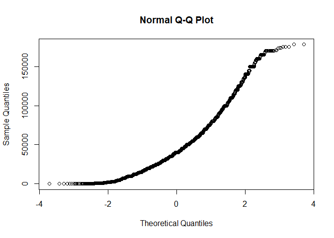<!-- -->

From above, we can see that there’s a peculiar trend among top-coded
values which affects the normality of the `income` QQ plot. However, the
QQ plot of `income.clean` is a perfectly normal light-tailed plot.

The key takeaway here is that apart from the peculiarity among top-coded
values, the rest of the income values are almost normally distributed
for both `income` and `income.clean`.

3.  **Summary Tables: Comparitive analysis of `income` and
    `income.clean` to check impact on analysis**

However, the following summary tables help us see instances where
excluding top coded values **can** make a big difference. Let’s begin by
looking at a comprehensive summary table of `race`.

\#\#\#\#\#Table 5: Comapritive Analysis of `income` and `income.clean`
by `race`

    ##            Female     Male NoTC.Diff  TC.Diff NoTC.PercDiff TC.PercDiff
    ## Black    35020.28 42760.62  7740.339 12004.78      18.10156    25.52847
    ## Hispanic 39383.50 51751.27 12367.765 21250.20      23.89848    34.14220
    ## NBNH     41753.26 60870.71 19117.448 36999.23      31.40665    45.67233
    ##          Difference
    ## Black       7.42691
    ## Hispanic   10.24372
    ## NBNH       14.26568

From the above table we can see that there is almsot a **14%**
difference between `income` with and without top-coded values amongst
the **Non Black Non Hispanic Racial Cohort**. This is a pretty big
difference. However, we can also observe that the absolute differences
in income between men and women is much higher in case of income
**with** top-coded values than without. This could be as a result of the
high average income of the top 2% earners which could leading to skewing
our analysis.

Let’s do a similar analysis with `industry`.

\#\#\#\#\#Table 6: Comparitive Analysis of `income` and `income.clean`
by `industry`

    ##                                Female     Male NoTC.Diff    TC.Diff
    ## Accomodations & Food         25090.06 32586.60  7740.339  23665.035
    ## Active Military              50081.10 71248.10 12367.765  22914.318
    ## Agri Forest Fish             20069.44 40892.74 19117.448  28396.731
    ## Armed Forces                 71000.00 66400.00  7740.339  -4600.000
    ## Arts Entertainment           36327.73 50318.40 12367.765  13990.674
    ## Construction                 45130.65 43472.58 19117.448    364.540
    ## Education Services           41110.29 52941.62  7740.339  17949.985
    ## Except Public Administration 24324.00 41831.07 12367.765  28796.748
    ## Finance Insurance            52462.77 77135.48 19117.448 111638.322
    ## Health Care                  38106.37 54949.15  7740.339  49180.188
    ## Manage Admin Services        31636.40 34085.65 12367.765   7463.792
    ## Manufacturing                37944.95 61467.28 19117.448  32260.666
    ## Mining                       45453.92 54090.64  7740.339  18397.299
    ## Other                        48665.93 52630.31 12367.765  14181.917
    ## Prof Sci Tech Services       49875.12 85817.74 19117.448  67112.588
    ## Real Estate                  45961.00 38921.43  7740.339  -8975.008
    ## Retail Trade                 23805.40 42227.13 12367.765  30782.498
    ## Uncodeable                   49640.77 64388.00 19117.448  14747.231
    ## Utilities                    45978.72 61652.68  7740.339  29289.799
    ##                              NoTC.PercDiff TC.PercDiff Difference
    ## Accomodations & Food             23.004996  48.5385922  25.533596
    ## Active Military                  29.708859  31.3914454   1.682586
    ## Agri Forest Fish                 50.921746  58.5908225   7.669076
    ## Armed Forces                     -6.927711  -6.9277108   0.000000
    ## Arts Entertainment               27.804288  27.8042876   0.000000
    ## Construction                     -3.814057   0.8012717   4.615329
    ## Education Services               22.347870  29.9828380   7.634968
    ## Except Public Administration     41.851831  54.2099818  12.358151
    ## Finance Insurance                31.986211  68.0302145  36.044004
    ## Health Care                      30.651574  56.3433687  25.691795
    ## Manage Admin Services             7.185557  17.5796031  10.394046
    ## Manufacturing                    38.268055  43.6061168   5.338062
    ## Mining                           15.967124  27.4482344  11.481111
    ## Other                             7.532512  22.5654798  15.032968
    ## Prof Sci Tech Services           41.882510  51.3891809   9.506671
    ## Real Estate                     -18.086621 -19.5056599  -1.419039
    ## Retail Trade                     43.625332  56.3906974  12.765365
    ## Uncodeable                       22.903694  22.9036944   0.000000
    ## Utilities                        25.422996  38.2230767  12.800081

Even here we observe a very high %Diff in incomes with and without
top-coded values in case of **Financial Insurance, Accomodations & Food,
Health Care and Retail Trade**. But similar to our observation in the
case of `race`, we can see that the absolute differences are very high
in case of income **with** top-coded values than without. Therefore, we
can conclude for the moment that while excluding top-coded values will
definitely have some impact, we are yet to determine if that impact is
in fact significant.

We will further speculate this difference with regressions in the
**Findings** section of this project.

\#\#\#\#**Creating a Subset with only those born in the US** To further
strealmine my analysis, I created a subset of my dataset to include only
those individuals who were born **in the US**. This reduces my
population from 12686 to 11812 individuals.

\#\#\#\#**Other Interesting Trends and Findings:**

As we observed earlier in the **Data Summary** section with `race`,
`south`(Place of Birth) and `industry`, we can see that the average
income of women is lower than that of men across other factors too. I
decided to investigate this difference in greater depth with `drug.use`
and `foreign.lang`.

Let’s look at a more in-depth analysis of gender-based income difference
across the various sub categories of `drug.use` and `foreign.lang`.

\#\#\#a) Drug-Use:

\#\#\#\#\#Plot 7
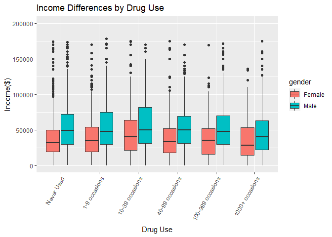<!-- -->

For the above plot, we can see the median income of women is lower that
of men across varying number of occassions of marijuana use. I performed
a very similar analysis to the one above for `drug.use` using income
both with and without top-coded values.

\#\#\#\#\#Table7: Regresing Income on Gender and Foreign Language
<table>
<thead>
<tr>
<th style="text-align:left;">
</th>
<th style="text-align:right;">
Estimate
</th>
<th style="text-align:right;">
Std. Error
</th>
<th style="text-align:right;">
t value
</th>
<th style="text-align:right;">
Pr(&gt;\|t\|)
</th>
</tr>
</thead>
<tbody>
<tr>
<td style="text-align:left;">
(Intercept)
</td>
<td style="text-align:right;">
38141.228
</td>
<td style="text-align:right;">
867.073
</td>
<td style="text-align:right;">
43.988
</td>
<td style="text-align:right;">
0.0000
</td>
</tr>
<tr>
<td style="text-align:left;">
genderMale
</td>
<td style="text-align:right;">
15152.503
</td>
<td style="text-align:right;">
959.553
</td>
<td style="text-align:right;">
15.791
</td>
<td style="text-align:right;">
0.0000
</td>
</tr>
<tr>
<td style="text-align:left;">
drug.use1-9 occasions
</td>
<td style="text-align:right;">
1574.479
</td>
<td style="text-align:right;">
1189.087
</td>
<td style="text-align:right;">
1.324
</td>
<td style="text-align:right;">
0.1855
</td>
</tr>
<tr>
<td style="text-align:left;">
drug.use10-39 occasions
</td>
<td style="text-align:right;">
6387.529
</td>
<td style="text-align:right;">
1578.918
</td>
<td style="text-align:right;">
4.046
</td>
<td style="text-align:right;">
0.0001
</td>
</tr>
<tr>
<td style="text-align:left;">
drug.use40-99 occasions
</td>
<td style="text-align:right;">
2044.799
</td>
<td style="text-align:right;">
1816.764
</td>
<td style="text-align:right;">
1.126
</td>
<td style="text-align:right;">
0.2604
</td>
</tr>
<tr>
<td style="text-align:left;">
drug.use100-999 occasions
</td>
<td style="text-align:right;">
1045.726
</td>
<td style="text-align:right;">
1726.084
</td>
<td style="text-align:right;">
0.606
</td>
<td style="text-align:right;">
0.5447
</td>
</tr>
<tr>
<td style="text-align:left;">
drug.use1000+ occasions
</td>
<td style="text-align:right;">
-6125.141
</td>
<td style="text-align:right;">
2003.490
</td>
<td style="text-align:right;">
-3.057
</td>
<td style="text-align:right;">
0.0022
</td>
</tr>
</tbody>
</table>

The baseline for this regressions is **Female** (for gender) and **Never
Used**(for drug use). And the results in this case were not
statistically significant either except for two cases:

**1. Drug-use: 10-39 occassions**

For this case, I observed that holding `gender` constant, a person
consuming Marijuana between 10-39 occassions makes **$ 6387.53** more
than a person who has never used Marijuana before! And this result is
statistically significant at a p-value of 0.0001.

It is also interesting to note that the general trend here (holding
`gender` constant) indicates that the income of an individual who has
used Marijuana **atleast once** and upto **999** times has a higher
income than an individual who has never used it before. But the income
difference is particulary the **highest** for a person who used it 10-39
times!

Albeit for categories apart from 10-39 occassions, the results are **not
statistically significant**.

**2. Drug-use: 1000+ occassions**

Having noted the above, we can see that holding `gender` constant, the
income of an individual who has used Marijuana at **1000+ occassions**
is **$ 6125.14** lesser than that of an individual who has never used
Marijuana before. This result is as expected to say that the income of a
person who is almost habitually consuming Marijuana is **significantly**
lesser than that of a person who has never consumed Marijuana before.
This result is also statistically significant at a p-value of 0.0022.

*Note: The results for the analysis of `drug.use` are very similar in
terms of trends and statistical significance irrespective of using
income with or without top-coded values.*

\#\#\#b) Foreign Language:

\#\#\#\#\#Plot 8
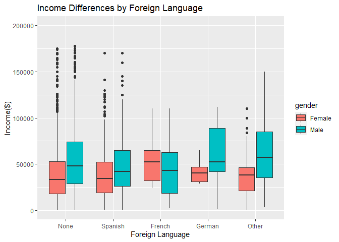<!-- -->

For the above plot, we can see that the the median income of women is
lower than that of men for all categories except for those women who
grew up in a household where **French** was spoken. For these women, the
median income is **higher** than that of men. This was very interesting
and unexpected as an outcome. To further investigate this anomaly, I ran
the follwing regression where I regressed `income.clean` **(without top
coded values)** on `gender` and `foreign.lang`:

\#\#\#\#\#Table 8: Regresing Income on Gender and Foreign Language
<table>
<thead>
<tr>
<th style="text-align:left;">
</th>
<th style="text-align:right;">
Estimate
</th>
<th style="text-align:right;">
Std. Error
</th>
<th style="text-align:right;">
t value
</th>
<th style="text-align:right;">
Pr(&gt;\|t\|)
</th>
</tr>
</thead>
<tbody>
<tr>
<td style="text-align:left;">
(Intercept)
</td>
<td style="text-align:right;">
39458.421
</td>
<td style="text-align:right;">
692.001
</td>
<td style="text-align:right;">
57.021
</td>
<td style="text-align:right;">
0.0000
</td>
</tr>
<tr>
<td style="text-align:left;">
genderMale
</td>
<td style="text-align:right;">
14892.894
</td>
<td style="text-align:right;">
937.844
</td>
<td style="text-align:right;">
15.880
</td>
<td style="text-align:right;">
0.0000
</td>
</tr>
<tr>
<td style="text-align:left;">
foreign.langSpanish
</td>
<td style="text-align:right;">
-2431.429
</td>
<td style="text-align:right;">
1362.709
</td>
<td style="text-align:right;">
-1.784
</td>
<td style="text-align:right;">
0.0744
</td>
</tr>
<tr>
<td style="text-align:left;">
foreign.langFrench
</td>
<td style="text-align:right;">
3592.796
</td>
<td style="text-align:right;">
6011.121
</td>
<td style="text-align:right;">
0.598
</td>
<td style="text-align:right;">
0.5501
</td>
</tr>
<tr>
<td style="text-align:left;">
foreign.langGerman
</td>
<td style="text-align:right;">
2955.747
</td>
<td style="text-align:right;">
5911.890
</td>
<td style="text-align:right;">
0.500
</td>
<td style="text-align:right;">
0.6171
</td>
</tr>
<tr>
<td style="text-align:left;">
foreign.langOther
</td>
<td style="text-align:right;">
3328.935
</td>
<td style="text-align:right;">
3038.404
</td>
<td style="text-align:right;">
1.096
</td>
<td style="text-align:right;">
0.2733
</td>
</tr>
</tbody>
</table>

Our baseline in this regression is **Female** (for gender) and
**None**(for foreign language). From the above results we have the
following key takeaways:

1.  The income of a female with no foreign langauge spoken during her
    childhood makes $ 39,458.421 which is our baseline.

2.The difference in income betweeno a **female** with French-speaking
childhood and **male** with a French-speaking chilhood is:

*(intercept + foreign.langFrench + genderMale) - (intercept +
foreign.langFrench)*

= *(39,458.421 + 3592.796 + 14,892.894) - (39,458.421 + 3592.796)*

= **$ 14,892.894**

3.  But at p-value of 0.5501, this is **not** a statistically
    significant result.

4.  We also observe that holding `gender` constant, a Spanish speaking
    individual makes $ 2431.43 **less** than an individual with no
    foreign language spoken during their childhood. However, at a
    p-value of 0.0744 this result too is **not** statistically
    significant.

*Note: The results for the analysis of `foreign.lang` are very similar
in terms of trends and statistical significance irrespective of using
income with or without top-coded values.*

\#\#\#\#\#Conclusion for this section: We can conclude that irrespective
of using income with or without top-coded values, both **Foreign
Language** and **Drug Use** are overall not statistically significant
predictors of income differences between men and women. Which brings us
to the next section of my analysis where I explore the effects of
`race`, `south`(place of birth) and `marital.status` on gender-based
income disparity. These are the variables that I’ve chosen to illustrate
my main findings.

                                                  *************************************
                                                  

\#\#\#3. Findings:

This section will primarily cover factors that have a **statistically
significant** impact in contributing to the gender-based income
disparity.

\#\#\#a) Race:

Let us begin by looking at a linear regression output of `income` vs
`gender`, `race` and `south`(Place of Birth)

\#\#\#\#\#Table 9: Regresing Income on Gender, Race and Place of Birth
<table>
<thead>
<tr>
<th style="text-align:left;">
</th>
<th style="text-align:right;">
Estimate
</th>
<th style="text-align:right;">
Std. Error
</th>
<th style="text-align:right;">
t value
</th>
<th style="text-align:right;">
Pr(&gt;\|t\|)
</th>
</tr>
</thead>
<tbody>
<tr>
<td style="text-align:left;">
(Intercept)
</td>
<td style="text-align:right;">
34548.991
</td>
<td style="text-align:right;">
1145.101
</td>
<td style="text-align:right;">
30.171
</td>
<td style="text-align:right;">
0.0000
</td>
</tr>
<tr>
<td style="text-align:left;">
genderMale
</td>
<td style="text-align:right;">
14781.752
</td>
<td style="text-align:right;">
920.559
</td>
<td style="text-align:right;">
16.057
</td>
<td style="text-align:right;">
0.0000
</td>
</tr>
<tr>
<td style="text-align:left;">
raceHispanic
</td>
<td style="text-align:right;">
5821.813
</td>
<td style="text-align:right;">
1507.381
</td>
<td style="text-align:right;">
3.862
</td>
<td style="text-align:right;">
0.0001
</td>
</tr>
<tr>
<td style="text-align:left;">
raceNBNH
</td>
<td style="text-align:right;">
10611.577
</td>
<td style="text-align:right;">
1109.272
</td>
<td style="text-align:right;">
9.566
</td>
<td style="text-align:right;">
0.0000
</td>
</tr>
<tr>
<td style="text-align:left;">
southSouth
</td>
<td style="text-align:right;">
-4731.754
</td>
<td style="text-align:right;">
1010.102
</td>
<td style="text-align:right;">
-4.684
</td>
<td style="text-align:right;">
0.0000
</td>
</tr>
<tr>
<td style="text-align:left;">
southOther
</td>
<td style="text-align:right;">
-5984.156
</td>
<td style="text-align:right;">
4586.638
</td>
<td style="text-align:right;">
-1.305
</td>
<td style="text-align:right;">
0.1921
</td>
</tr>
</tbody>
</table>

Our baseline for this regression is **Female** (for gender), **Black**
(for race) and **Not South**(for place of birth). From the above results
we have the follwing key takeaways:

1.  A black female who is not from the south has an income that is equal
    to the value at the intercept which is **$ 34,548.991**. This value
    is statistically significant at a p-vale of 0.

2.  Keeping `race` and `south`(place of birth) constant, the income of a
    male respondent is calculated as follows:

*intercept + genderMale*

= *34,581.991 + 14,781.752*

= **$ 49,363.74**

This value is statistically significant at a p-value of 0.

3.  Keeping `gender` and `south`(place of birth) constant, the income of
    a respondent who is Hispanic is calculated as follows:

*intercept + raceHispanic*

= *34,581.991 + 5821.813*

= **$ 40,403.8**

This value is statistically significant at a p-value of 0. The income
can be calculated in a similar manner for Non Black Non Hispanic
respondents as well. And that result is also statistically significant
at a p-value of 0.

4.  Keeping `gender` and `race` constant, the income of a respondent who
    is born in the South is calculated as follows:

*intercept + southSouth*

= *34,581.991 - 4731.754*

= **$ 29,850.24**

This value is statistically significant at a p-value of 0. The income
can be calculated in a similar manner for respondents born in a place
other than the north and south as well. However, at a p-value of 0.1921
that result is **not** statistically significant.

5.  Other calculations:

The income of a Hispanic male born in the South can be calculated as
follows:

*intercept + genderMale + raceHispanic + southSouth*

= *34,581.991 + 14,781.752 + 5821.813 - 4731.75*

= **$ 50,453.81**

The income difference between a Female and Male both Black and born
neither in the north nor south can be calculated as follows:

*(intercept + genderMale + southOther) - (intercept + southOther)*

= *(34,581.991 + 14,781.752 - 4731.75) - (34,581.991 - 4731.75)*

= **$ 14,781.752** -&gt; co-efficient of genderMale

*Note: The results for the above regression analysis of are very similar
in terms of trends and statistical significance irrespective of using
income with or without top-coded values.*

We dive a little deeper to see if race is infact a strong and
statstically significant predictor of the gender-based income
difference. To investigate this we perform an ANOVA test.

\#\#\#\#\#ANOVA: To test if race is statistically significant predictor
gender-based income difference

    ## Analysis of Variance Table
    ## 
    ## Model 1: income.clean ~ gender + south
    ## Model 2: income.clean ~ gender + race + south
    ##   Res.Df        RSS Df  Sum of Sq      F    Pr(>F)    
    ## 1   4764 4.8998e+12                                   
    ## 2   4762 4.8066e+12  2 9.3191e+10 46.163 < 2.2e-16 ***
    ## ---
    ## Signif. codes:  0 '***' 0.001 '**' 0.01 '*' 0.05 '.' 0.1 ' ' 1

From the above results, we have further evidence to safely conclude that
`race` is very strong predictor of gender-based income differences. To
further complement our analysis, we now take a look at the diagnostic
plots for our regression outcome `income.race.lm`.

\#\#\#\#\#Plot 9: Diagnostic Plots for `income.race.lm`

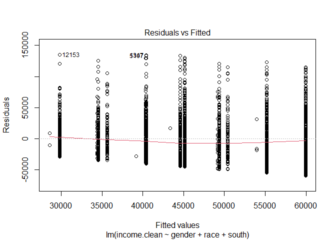<!-- -->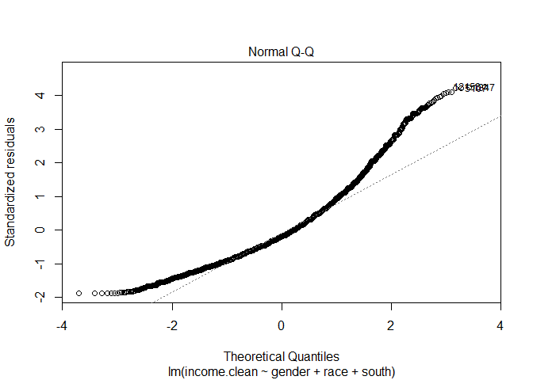<!-- -->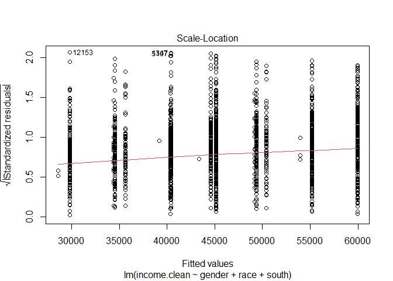<!-- -->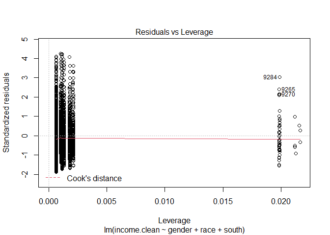<!-- -->

**a.Residual vs Fitted Plot:** From this plot, we can see that the trend
line is very close to the 0 line with a small deviation in the center.
This allows us to have a reasonable assumption that the relationship is
a **linear** one.

**b.QQ Plot:** From this plot, we can observe that the residuals from
the regression are almost perfectly normally distributed. This serves as
reasonable evidence to say that our p-values for this regression are
believable.

**c.Scale-Location Plot:** This plot is very similar to our Residual vs
Fitted Plot. And here as well, the residuals appear to be randomly
spread and we don’t observe any discernible trends.

**d.Residual vs Leverage Plot:** From this plot we observe that there
are no strong outliers. This is also beacuse we’ve used `income.clean`
for our analysis which does not contain 0s and top-coded values. Also,
we don’t observe any Cook’s distance lines as we don’t have any strong
outliers.

Now that we have a robust analysis of the impact of `race`, let’s look
at how race can affect the **income gap** between men and women of the
same racial cohort.

\#\#\#\#\#Plot 10

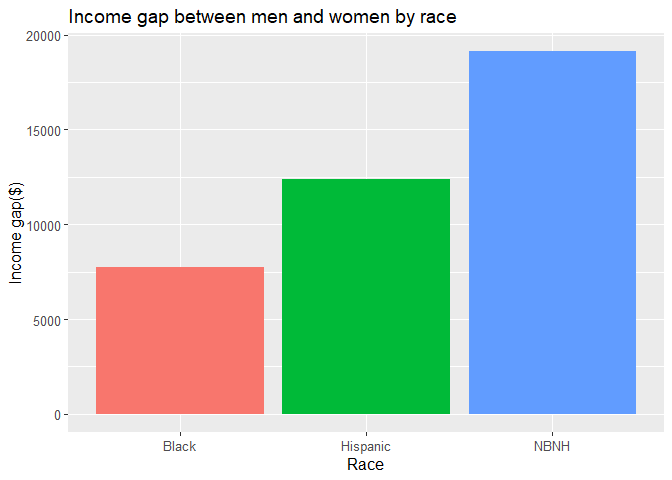<!-- -->

From the above plot, we can see that the income disparity between men
and women is largest among the **Non Black Non Hispanic** racial cohort
and the least within the **Black** cohort. This kind of visual
representation and in-depth analysis helps us understand that its not
only important to see that race has an impact on income but also on the
income gap within racial categories. This allows us to be able to more
specifically pin point communities towards which public policy efforts
need to be focused.

\#\#\#b) Marital Status: We now explore the next variable that has a big
impact on the gender-based income disparity.

\#\#\#\#\#Plot 11

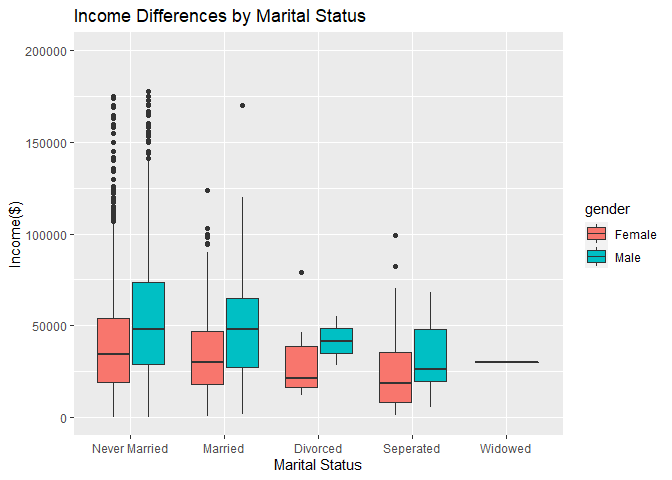<!-- --> From the
above plot, we can see that median income for women is lower than that
of men across all categories of `marital.status`. We will explore this
further by looking at a linear regression output of `income` vs `gender`
and `marital status`.

\#\#\#\#\#Table 10: Regresing Income on Gender and Marital Status

<table>
<thead>
<tr>
<th style="text-align:left;">
</th>
<th style="text-align:right;">
Estimate
</th>
<th style="text-align:right;">
Std. Error
</th>
<th style="text-align:right;">
t value
</th>
<th style="text-align:right;">
Pr(&gt;\|t\|)
</th>
</tr>
</thead>
<tbody>
<tr>
<td style="text-align:left;">
(Intercept)
</td>
<td style="text-align:right;">
40190.320
</td>
<td style="text-align:right;">
687.754
</td>
<td style="text-align:right;">
58.437
</td>
<td style="text-align:right;">
0.0000
</td>
</tr>
<tr>
<td style="text-align:left;">
genderMale
</td>
<td style="text-align:right;">
14241.473
</td>
<td style="text-align:right;">
942.642
</td>
<td style="text-align:right;">
15.108
</td>
<td style="text-align:right;">
0.0000
</td>
</tr>
<tr>
<td style="text-align:left;">
marital.statusMarried
</td>
<td style="text-align:right;">
-5300.275
</td>
<td style="text-align:right;">
1756.251
</td>
<td style="text-align:right;">
-3.018
</td>
<td style="text-align:right;">
0.0026
</td>
</tr>
<tr>
<td style="text-align:left;">
marital.statusDivorced
</td>
<td style="text-align:right;">
-10920.505
</td>
<td style="text-align:right;">
8079.435
</td>
<td style="text-align:right;">
-1.352
</td>
<td style="text-align:right;">
0.1766
</td>
</tr>
<tr>
<td style="text-align:left;">
marital.statusSeperated
</td>
<td style="text-align:right;">
-15676.722
</td>
<td style="text-align:right;">
5635.485
</td>
<td style="text-align:right;">
-2.782
</td>
<td style="text-align:right;">
0.0054
</td>
</tr>
<tr>
<td style="text-align:left;">
marital.statusWidowed
</td>
<td style="text-align:right;">
-10190.320
</td>
<td style="text-align:right;">
32232.710
</td>
<td style="text-align:right;">
-0.316
</td>
<td style="text-align:right;">
0.7519
</td>
</tr>
</tbody>
</table>

Our baseline for this regression is **Female** (for gender) and **Never
Married**(for marital status). From the above results we have the
follwing key takeaways:

1.  The income of a female who has never been married is the value at
    the intercept equal to **$ 40,190.32**. This value is statistically
    significant at a p-vale of 0.

2.  Keeping `marital.status` constant, the income of a male respondent
    is calculated as follows:

*intercept + genderMale*

= *40,190.31 + 14,241.473*

= **$ 54,431.78**

This value is statistically significant at a p-value of 0.

3.  Keeping `gender` constant, the income of a respondent who is Married
    is calculated as follows:

*intercept + marital.statusMarried*

= *40,190.31 - 5300.275*

= **$ 34,890.03 **

This value is statistically significant at a p-value of 0.0026. The
income can be calculated in a similar manner for Divorced, Seperated and
Widowed respondents as well to be **$ 29,269.81**, **$ 24,513.59** and
**$ 30,000 ** respectively. But **none** of these results are
statistically significant.

4.  Other calculations:

The income of a Seperated Female can be calculated as follows:
*intercept + marital.statusSeperated*

= *40,190.31 -15,676.222*

= **$ 24,514.09**

The income of a Divorced Male can be calculated as follows:

*intercept + genderMale + marital.statusDivorced*

= *40,190.31 + 14,241.473 -10,920.505*

= **$ 43,511.28**

The income difference between a Female and Male both Married can be
calculated as follows:

*(intercept + genderMale + marital.statusMarried) - (intercept +
marital.statusMarried)*

= *(40,190.31 + 14,241.473 - 5300.275 ) - (40,190.31 - 5300.275)*

= *14,241.473* -&gt; co-efficient of genderMale

**Important Note:** Again, it is important to note that the regression
was run for income without top-coded values. But the analysis, trends
and results obtained are in no way impacted if we use income with
top-coded values.

To further investigate the **income gap** within each category of
`marital.status`, we will look at a regression with interaction terms
between `gender` and `marital.status`.

\#\#\#\#\#Table 11: Regresing Income on Gender and Marital Status (with
interaction)
<table>
<thead>
<tr>
<th style="text-align:left;">
</th>
<th style="text-align:right;">
Estimate
</th>
<th style="text-align:right;">
Std. Error
</th>
<th style="text-align:right;">
t value
</th>
<th style="text-align:right;">
Pr(&gt;\|t\|)
</th>
</tr>
</thead>
<tbody>
<tr>
<td style="text-align:left;">
(Intercept)
</td>
<td style="text-align:right;">
40223.278
</td>
<td style="text-align:right;">
700.072
</td>
<td style="text-align:right;">
57.456
</td>
<td style="text-align:right;">
0.0000
</td>
</tr>
<tr>
<td style="text-align:left;">
genderMale
</td>
<td style="text-align:right;">
14177.406
</td>
<td style="text-align:right;">
976.068
</td>
<td style="text-align:right;">
14.525
</td>
<td style="text-align:right;">
0.0000
</td>
</tr>
<tr>
<td style="text-align:left;">
marital.statusMarried
</td>
<td style="text-align:right;">
-5759.121
</td>
<td style="text-align:right;">
2049.602
</td>
<td style="text-align:right;">
-2.810
</td>
<td style="text-align:right;">
0.0050
</td>
</tr>
<tr>
<td style="text-align:left;">
marital.statusDivorced
</td>
<td style="text-align:right;">
-10666.135
</td>
<td style="text-align:right;">
8643.232
</td>
<td style="text-align:right;">
-1.234
</td>
<td style="text-align:right;">
0.2172
</td>
</tr>
<tr>
<td style="text-align:left;">
marital.statusSeperated
</td>
<td style="text-align:right;">
-13819.862
</td>
<td style="text-align:right;">
6616.827
</td>
<td style="text-align:right;">
-2.089
</td>
<td style="text-align:right;">
0.0368
</td>
</tr>
<tr>
<td style="text-align:left;">
marital.statusWidowed
</td>
<td style="text-align:right;">
-10223.278
</td>
<td style="text-align:right;">
32241.359
</td>
<td style="text-align:right;">
-0.317
</td>
<td style="text-align:right;">
0.7512
</td>
</tr>
<tr>
<td style="text-align:left;">
genderMale:marital.statusMarried
</td>
<td style="text-align:right;">
1772.200
</td>
<td style="text-align:right;">
3979.407
</td>
<td style="text-align:right;">
0.445
</td>
<td style="text-align:right;">
0.6561
</td>
</tr>
<tr>
<td style="text-align:left;">
genderMale:marital.statusDivorced
</td>
<td style="text-align:right;">
-2234.549
</td>
<td style="text-align:right;">
24385.972
</td>
<td style="text-align:right;">
-0.092
</td>
<td style="text-align:right;">
0.9270
</td>
</tr>
<tr>
<td style="text-align:left;">
genderMale:marital.statusSeperated
</td>
<td style="text-align:right;">
-6865.267
</td>
<td style="text-align:right;">
12636.895
</td>
<td style="text-align:right;">
-0.543
</td>
<td style="text-align:right;">
0.5870
</td>
</tr>
</tbody>
</table>

Our baseline for this regression is **Female** (for gender) and **Never
Married**(for marital status). From the above results we have the
following key takeaways:

1.  Income difference between a divorced and never-married male can be
    calculated as follows:

*(intercept + genderMale + marital.statusDivorced +
genderMale:marital.statusDivorced) - (intercept + genderMale)*

*( 40,190.31 + 14,177.406 -10,920.505 - 2234.549) - (40,190.31 +
14,177.406)*

**$ -13155.05**

2.  Relative to a never married female: Married women income = **$
    34,431.2**

Formula : *intercept + marital.statusMarried*

Divorced women income = **$ 29,524.18**

Formula : *intercept + marital.statusDivorced*

Seperated women income = **$ 26,370.46**

Formula : *intercept + marital.statusSeperated*

Widowed women income = **$ 29,967.04**

Formula : *intercept + marital.statusWidowed*

3.  Relative to a never married male: Married men income = **$
    50380.79**

Formula : *intercept + genderMale + marital.statusMarried +
genderMale:marital.statusMarried*

Divorced men income = **$ 41467.03**

Formula : *intercept + genderMale + marital.statusDivorced +
genderMale:marital.statusDivorced*

Seperated men income = **$ 33682.59**

Formula : *intercept + genderMale + marital.statusSeperated +
genderMale:marital.statusSeperated*

As a final step to ensure that `marital.status` is in fact a
statistically significant predictor of the gender-based income
disparity, we do the ANOVA test.

\#\#\#\#\#ANOVA: To test if marital status is statistically significant
predictor gender-based income difference

    ## Analysis of Variance Table
    ## 
    ## Model 1: income.clean ~ 1
    ## Model 2: income.clean ~ gender + marital.status + gender * marital.status
    ##   Res.Df        RSS Df  Sum of Sq      F    Pr(>F)    
    ## 1   4788 5.2476e+12                                   
    ## 2   4780 4.9665e+12  8 2.8114e+11 33.823 < 2.2e-16 ***
    ## ---
    ## Signif. codes:  0 '***' 0.001 '**' 0.01 '*' 0.05 '.' 0.1 ' ' 1

From the results, it is evident that `marital status` is a strong
predictor of gender-based income difference. At a p-value of 0, this
result is statistically significant.

                                                  *************************************
                                                  

\#\#\#4. Discussion:

The major takeaway through this project is that **Race**, **Place of
Birth** and **Marital Status** are all strong predictors of the income
disparity between men and women. While there were some interesting
takeaways with `drug.use` and `foreign.lang` variables, the results were
not statistivcally significant.

Throughout my analysis, I’ve used an alpha level of **0.05**. Therefore,
I can say than I am **95% confident** of my results especially w.r.t to
the analysis conducted in the **Findings** section of this report.
However there are also some potential drawabacks:

1.  For the purpose of not letting outlier data impact my analysis I
    removed 0s and top-coded values from my Income variable. I suspect
    that this could have an impact on the **external validity** of my
    analysis.

2.  Despite being a comprehensive dataset with several thousand
    respondents and multiple variables, I suspect the generalizability
    of my findings. I would like to run a similar analysis for NLSY data
    for subsequent years to make conclusions surrounding the
    generalizability of my findings. Only after that will I be confident
    enough to share my findings with policy makers.

But for the most part I do believe that there is sufficent conclusive
proof to indicate without doubt what factors are responsible for income
differences between men and women and what are not. If anything, this
analysis can prove to be a robust starting point for conversations
surrounding gender-based income disparity and further analysis.

                                                  *************************************
                                                                  The End
